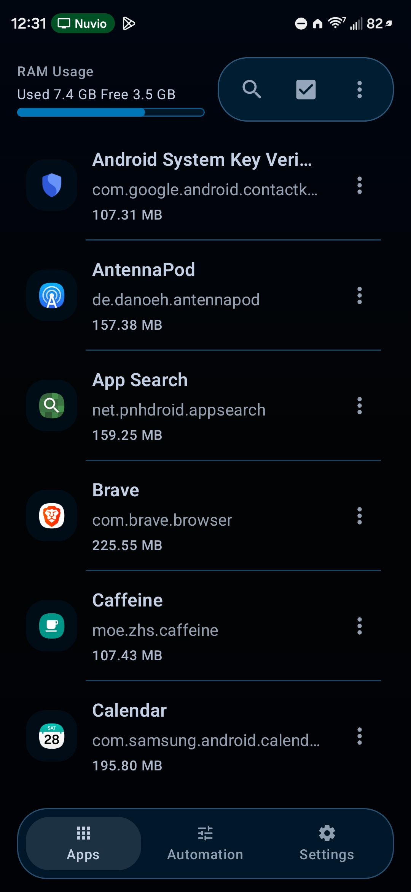
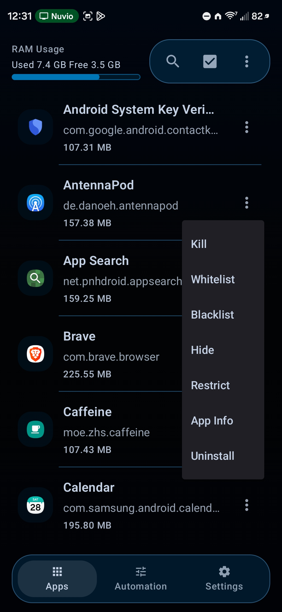
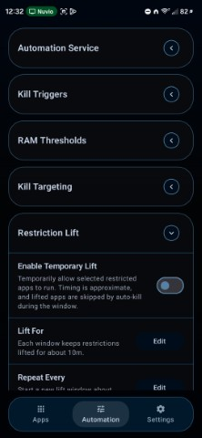
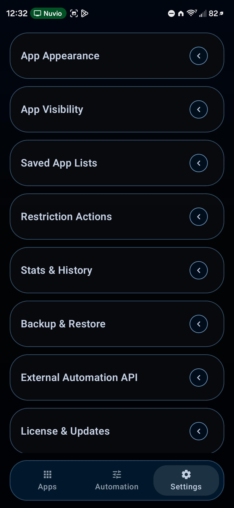

# Process Warden

Process Warden is a premium Android utility for force-stop workflows, automation, and background restriction management. It is the maintained successor to Appzuku: same core idea, cleaner architecture, stronger automation, proper licensing, OTA updates, and a modern Kotlin + Compose UI.

This app is built for Android power users who already understand Shizuku or root access and want direct control over misbehaving apps, repeatable cleanup, and restriction enforcement.

## Screenshots

| Apps Tab | App Actions |
| --- | --- |
|  |  |

| Automation Tab | Settings Tab |
| --- | --- |
|  |  |

## What Process Warden Is For

Android exposes just enough process control to be frustrating. Process Warden closes that gap.

It gives you a single place to:
- kill the current foreground app or selected running apps
- automate cleanup on a schedule, on screen-off, or under RAM pressure
- save and reapply Android background restrictions
- temporarily lift those restrictions on a repeatable schedule
- monitor what the app did through history, logs, and status messaging

The goal is not to imitate a generic task killer. The goal is predictable control over app state, with automation and restriction tooling that stays usable over time.

## Why It Exists

Appzuku proved the core demand. A lot of users wanted direct, scriptable control over force-stop and restriction workflows, but the original app had clear limits.

Process Warden is the follow-through:
- rebuilt as a maintained Kotlin + Compose codebase
- structured as a premium product instead of an experimental utility
- designed around reliable automation, diagnostics, licensing, and update delivery
- expanded to handle background restrictions and temporary exception windows, not just killing apps

## Highlights

- Foreground-app kill from a launcher shortcut, Quick Settings tile, or widget
- Manual multi-app kill from the Apps tab
- Configurable background cleanup with whitelist and blacklist targeting
- Saved background restriction set with apply, reapply, verify, and repair flows
- Temporary Restriction Lift that restores restrictions automatically after a defined window
- Premium licensing with Polar checkout, key activation, deactivation, and offline grace handling
- In-app OTA update checks and installs through GitHub Releases
- External automation API for tools like Tasker and MacroDroid
- Localized UI and EULA support with in-app language switching

## Feature Overview

### App Control
- Kill a single app or multiple selected apps from the Apps tab.
- Kill the current foreground app from the launcher shortcut, Quick Settings tile, or widget.
- Run a configured background-kill action from the secondary Quick Settings tile.
- Search, sort, and filter running apps with optional system-app and persistent-app visibility.
- Use per-app actions for kill, whitelist, blacklist, hide, background restriction, app info, and uninstall.

### Automation
- Enable or disable automation globally.
- Run cleanup periodically with intervals ranging from short service-driven runs to longer WorkManager-backed runs.
- Trigger cleanup on screen-off.
- Gate cleanup behind a RAM threshold.
- Restore automation state after boot.
- Reapply active automation state when the app reopens.

### Background Restrictions
- Save the exact app set that should remain background-restricted.
- Apply restrictions immediately.
- Reapply them later without rebuilding the list.
- Verify restriction drift and repair it.
- View and clear a restriction log inside the app.
- Handle out-of-sync or externally changed restriction state with explicit prompts instead of silent failure.

### Temporary Restriction Lift
- Choose a separate list of apps that can be temporarily exempted from restrictions.
- Configure a lift duration and repeat interval.
- Restore restrictions automatically when the lift window ends.
- Reconcile lift state after boot or missed transitions.
- Prevent lifted apps from being immediately re-restricted or auto-killed while the lift is active.

### Premium, Licensing, and Updates
- First-run paywall with EULA review.
- Polar checkout handoff and license-key activation.
- Dedicated handling for activation-capacity exhaustion and recovery.
- Retrieve an existing license through the Polar portal.
- Deactivate the current device from Settings.
- Cached local premium access with offline grace handling.
- OTA checks and APK downloads from `northmendo/ProcessWarden` through GitHub Releases.
- Install-ready notifications and in-app install handoff when an update finishes downloading.

### Backup, Migration, and Diagnostics
- Export and import Process Warden backups.
- Import legacy Appzuku backups.
- Preserve durable settings while keeping the automation auth token out of backups.
- View kill history and top offenders.
- Open built-in help content from the app.
- Track current status through clear toast and settings messaging.

### Appearance and Localization
- System, light, and dark theme modes.
- Adjustable accent, chrome, separator, and text colors.
- Full color picker with preview and hex input.
- `Auto` language mode plus English, Simplified Chinese, and Brazilian Portuguese.
- Locale-specific EULA loading when a translated EULA is available.

## Requirements

- Android 6.0 or newer to run the app
- Android 11 or newer for the background restriction workflow
- Shizuku or root for kill and restriction operations
- Internet access for:
  - first license validation
  - periodic license revalidation
  - Polar portal access
  - OTA update checks

## Installation and First Run

1. Download the APK from the official GitHub Releases page.
2. Install it on the device.
3. Launch Process Warden.
4. Review and accept the EULA.
5. Start checkout through Polar, retrieve your license, or paste an existing key.
6. Activate the license on the device.
7. Grant Shizuku or root access if you want kill and restriction actions to function.

## External Automation API

Process Warden exposes a broadcast receiver for automation tools such as Tasker and MacroDroid.

Rules:
- The receiver must be enabled in Settings.
- Every request requires a valid `auth_token`.
- Premium access is required.
- Results are returned through a separate broadcast.

### Supported Actions

- `com.northmendo.processwarden.action.KILL_FOREGROUND_APP`
- `com.northmendo.processwarden.action.KILL_PACKAGE`
- `com.northmendo.processwarden.action.RUN_BACKGROUND_KILL`
- `com.northmendo.processwarden.action.SET_AUTOMATION_ENABLED`
- `com.northmendo.processwarden.action.SET_PERIODIC_KILL_ENABLED`
- `com.northmendo.processwarden.action.SET_SCREEN_OFF_KILL_ENABLED`
- `com.northmendo.processwarden.action.SET_BACKGROUND_RESTRICTION`
- `com.northmendo.processwarden.action.REAPPLY_BACKGROUND_RESTRICTIONS`
- `com.northmendo.processwarden.action.VERIFY_BACKGROUND_RESTRICTIONS`

### Request Extras

- `auth_token`
- `request_id`
- `package_name`
- `enabled`

### Result Broadcast

- Action: `com.northmendo.processwarden.action.COMMAND_RESULT`

### Result Extras

- `request_id`
- `command`
- `status`
- `message`
- `package_name`

## Localization Notes

- English is the source locale.
- App strings live under `app/src/main/res/values-xx/strings.xml`.
- Localized EULA assets live under `app/src/main/res/raw-xx/process_warden_eula.txt`.
- Translation workflow notes live in [docs/translations.md](docs/translations.md).

## Build

```powershell
.\gradlew.bat assembleDebug --no-daemon
```

## License

Process Warden is a commercial product. Use and distribution are governed by the bundled [EULA](EULA.md) and a valid Polar license.
